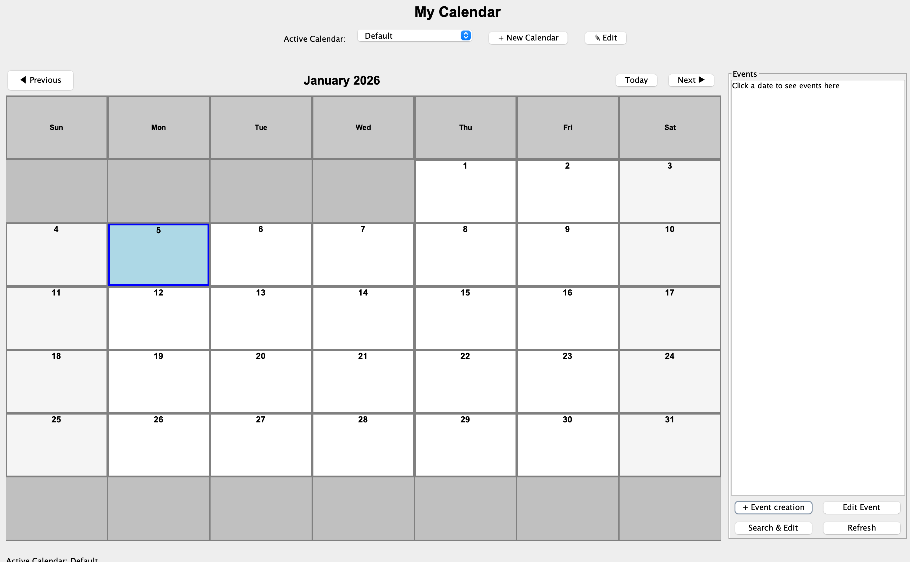

# 🗓️ Calendar Application

> **Event management system with MVC architecture, design patterns, and dual CLI/GUI interfaces**


**Key Features:** MVC Architecture | Strategy Pattern | SOLID Principles | CLI + GUI Interfaces

## 📖 Overview

A calendar management system supporting multiple calendars with independent timezones, recurring events, and both command-line and graphical user interfaces. Demonstrates clean software architecture with proper separation of concerns.

**Core Capabilities:**
- ✅ Multiple calendars with independent timezone support
- ✅ Recurring events with flexible weekly patterns
- ✅ Dual interfaces - CLI (interactive & file-based) and GUI (Swing)
- ✅ Design patterns: Strategy, Command, Factory, Builder
- ✅ SOLID principles throughout codebase

## 🏗️ Architecture

### MVC with Service Layer
```
View Layer (CLI/GUI) → Presentation only, no business logic
         ↓
Controller → Coordinates user actions, calls model
         ↓
DTO/Service Layer → Transforms input into structured data
         ↓
Model Layer:
  - CalendarModel (Business coordinator)
  - Strategy Layer (Operation algorithms)
  - Domain Entities (Calendar, Event - immutable)
  - Storage (CalendarCollection interface)
```

**Design Patterns:**
- **Strategy Pattern:** 15+ strategies for different operations (create, edit, query, copy, export)
- **Builder Pattern:** Immutable domain objects with validated construction
- **Command Pattern:** CLI commands encapsulated as DTOs
- **Factory Pattern:** Strategy selection and instantiation

**SOLID Principles:**
- Single Responsibility: Each strategy handles one operation type
- Open/Closed: New operations added via new strategies without modifying existing code
- Interface Segregation: Specific interfaces for each operation
- Dependency Inversion: Controllers depend on abstractions, not implementations

## ✨ Key Features

### Calendar Management
- Create multiple calendars with custom timezones
- Edit calendar names and timezones
- Switch between calendars seamlessly
- Timezone conversion with automatic event time adjustment

### Event Creation & Editing
- **Single events:** One-time timed or all-day events
- **Recurring events:** Weekly patterns (M/T/W/R/F/S/U), repeat N times or until date
- **Edit scopes:** Single occurrence, this and future, or entire series
- **Multi-property editing** (GUI only) - Change subject, time, location, description together
- **Bulk edit:** Search and modify multiple matching events

### Advanced Operations
- Copy events between calendars with timezone conversion
- Weekday pattern preservation in bulk copy
- Export to Google Calendar CSV or iCalendar (.ics)
- Availability checking at specific times
- Duplicate prevention

## 🖥️ Application Interfaces

### GUI Mode
<p align="center">
  
  <br>
  <i>Swing-based interface with calendar grid, navigation, and event management</i>
</p>

**Features:**
- Calendar dropdown selector
- Month navigation (Previous/Today/Next buttons)
- Date selection grid
- Event list panel for selected date
- Create/Edit buttons for calendars and events
- Search & bulk edit functionality

### CLI Mode
```bash
$ java -jar calendar-1.0.jar --mode interactive

Welcome to Calendar!
> create calendar --name "Work" --timezone "America/New_York"
New calendar 'Work' created.

> create event "Team Meeting" from 2025-12-01T10:00 to 2025-12-01T11:00 repeats MWF for 10 times
events created now is 10

> print events on 2025-12-01
1 event(s) found:
1. Event{subject='Team Meeting', startDateTime=2025-12-01T10:00...}
```

## 🚀 How to Use

### Build the Application
```bash
# Build JAR file using Gradle
./gradlew clean build

# JAR created at: build/libs/calendar-1.0.jar
```

### Running the Application

#### **GUI Mode** (Recommended for beginners)
```bash
java -jar build/libs/calendar-1.0.jar
```

**Quick Start:**
1. Application opens with default calendar
2. Click **"Create Calendar"** to add your own calendar
3. Select a date on the grid
4. Click **"Create Event"** to add events
5. Use navigation buttons to browse months
6. Click dates to view events in the side panel

#### **CLI Interactive Mode** (For power users)
```bash
java -jar build/libs/calendar-1.0.jar --mode interactive
```

**Common Commands:**
```bash
# Create calendar
create calendar --name "Work" --timezone "America/New_York"

# Set active calendar
use calendar --name "Work"

# Create single event
create event "Meeting" from 2025-12-01T10:00 to 2025-12-01T11:00

# Create recurring event (every Monday/Wednesday/Friday, 10 times)
create event "Standup" from 2025-12-01T09:00 to 2025-12-01T09:15 repeats MWF for 10 times

# Create all-day event
create event "Holiday" on 2025-12-25

# Query events on date
print events on 2025-12-01

# Edit single occurrence
edit event subject "Meeting" from 2025-12-01T10:00 to 2025-12-01T11:00 with "Sprint Planning"

# Export calendar
export cal my_calendar.csv
```

#### **CLI Headless Mode** (For automation)
```bash
java -jar build/libs/calendar-1.0.jar --mode headless path/to/commands.txt
```

**Example commands.txt:**
```
create calendar --name "School" --timezone "America/Chicago"
use calendar --name "School"
create event "Class" from 2025-12-01T10:00 to 2025-12-01T11:30 repeats MWF for 15 times
export cal school_calendar.ical
```

## 🎯 Technical Implementation

### Core Design

**Immutability:**
- All domain objects (`Calendar`, `Event`) immutable with final fields
- Modifications create new instances, ensuring data integrity

**Timezone Handling:**
- Each calendar has independent `ZoneId`
- Events use `ZonedDateTime` for proper timezone representation
- Cross-timezone copying automatically adjusts times
- Handles daylight saving time transitions

**Recurring Events:**
- Separate `Event` objects sharing common `seriesId` (UUID)
- Three edit scopes: single, forward, or entire series
- Weekday pattern preservation in bulk operations

**Storage:**
- `CalendarCollection` interface abstracts storage
- Current implementation: in-memory HashMap
- Easily replaceable with database or file storage

## 🛠️ Tech Stack

**Language:** Java 11+  
**UI:** Java Swing (GUI), Console I/O (CLI)  
**Build:** Gradle  
**Date/Time:** `java.time` API (ZonedDateTime)  
**Patterns:** MVC, Strategy, Builder, Command, Factory


<p align="center">
  <i>⭐ Demonstrates clean architecture, design patterns, and software engineering best practices</i>
</p>
